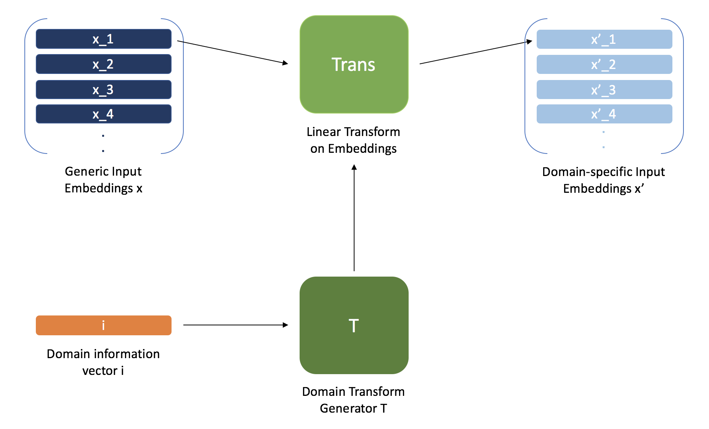

# Conditioning Language Models for Domain Adaptation

This repository contains the code for my senior thesis on a method for training language models to perform zero-shot domain adaptation. All models are implemented in Pytorch. Read the thesis [here](https://www.dropbox.com/s/qu3k4m6lou60u5b/Thesis_Final_Report.pdf?dl=0).

## About the Method

### What is "zero-shot domain adaptation"? Why does it matter?

In simple terms, "zero-shot domain adaptation" here means training a model to be able to perform a task well in domains that it has not trained on - to adapt well to such domains with "zero" training data. At a high level, I've attempted to solve this problem in a language context, by coming up with a mechanism that learns to modulate a language model's parameters based on some information about the domain that the model's input is coming from.

To motivate the problem from a practical perspective, consider a setting in which we want to perform a task in a certain domain, but have no training data for that domain. Perhaps we have some labeled training data for the task from other domains. We might try training a model on these domains and then transfer it to the domains we care about.

The model ends up learning a set of features for the domains it trains on. Assuming that the domains not present in the training data are different from the ones that are, a couple undesirable things might be happening:
- The model might learn "average" features across the domains - in this case, it doesn't really learn to adapt the features it looks for based on the training domain given, and certain doesn't do so for non-training domains. 
- The model might learn the domain-specific features for the domains it trains on - in this case, it still doesn't learn to 

The problem has significance from a "pure AI" perspective too, as humans solve it all the time. We're very good at learning something in a new domain with little-to-no experience, or conditioning the way we do something in a new setting based on some high-level knowledge about that setting. We'd like to make AI that can do this stuff too. 

### The Conditioning Mechanism

As stated, for my thesis, I've considered the zero-shot adaptation problem in the language context. A simple way in which the same language varies in its meaning/interpretation across domains is through changes in word meaning. While reading a horror film review, the word "terrifying" might be used to indicate a positive experience; in a restaurant review, this seems unlikely. Words like "LGBT" and "gun" are used with different connotations depending on whether they appear on a left-leaning or right-leaning online community. 

To account for this kind of change from domain to domain, we might train a "mechanism" that learns to accept some domain information as input, and produce an operation that modifies the words in an input sentence properly for the corresponding domain. The mechanism is parametrized by two transformations, each of which take domain information as input. These transformations learn to produce a transformation and a single-layered attention network, which work in the following way:

The produced transformation takes the generic embeddings in the input sentence and transforms them for the current domain:

- The attention network outputs a set of attentional weights describing the extent to which the transformed embedding - as opposed to the initial, generic embedding - should be used.
- Using the attentional weights, a weighted linear combination between the transformed and generic embeddings is taken to create new embeddings that represent the input sentence.

Once the new set of embeddings has been obtained, they are input to the language model that performs the task. A straightforward way to think about this is that the transformation and attention network the mechanism produces are part of the language model's embedding layer - we are thus using domain information to condition the embedding layer of a language model. The two transformations that parametrize the mechanism are trained in tandem with the language model on data and information from a set of training domains.

To illustrate what this is meant to do in practice, we can come back to one of the earlier examples. We might train a model to perform sentiment analysis on comments, and train a mechanism simultaneously to produce transformations/attn networks that modify a comment's word embeddings for the online community in which the comment occurs. The mechanism might learn to recognize left-leaning or right-leaning indicators from the domain information it is given, and produce transformations/attn networks that modify word accordingly. When given domain information indicating left-leaning discourse, it would produce a transformation that maps words like "LGBT" to a latent positive meaning, and "gun" to a latent negative meaning. It would also produce an attention network that chooses to represent the words "LGBT" and "gun" with the transformed embeddings, but chooses to represent words like "hello" or "goodbye" with generic ones (as their meaning doesn't really change with political leaning). 

### Experiments

## Running the Code

### Dependencies

### Running Experiments
